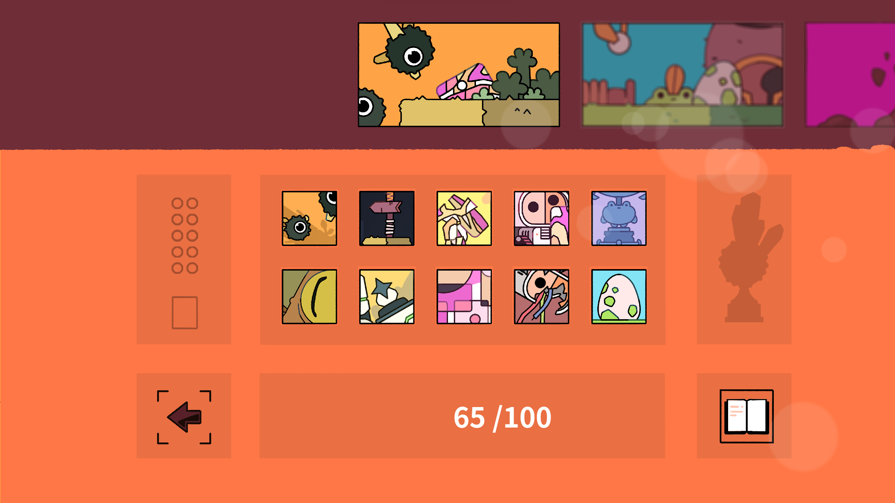
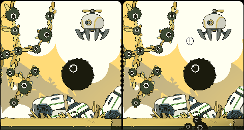

I'm Michaël Boyer, or Hephep. I'm a french videogame maker working mainly with Godot Engine.  
This is my portfolio, about all the projects I was involved in. Currently part of the Team Run. Have fun!
* * *

# In development
* * * 
## Broken Lens

* **Game Type:** Puzzle / Spot the differences
* **Platforms:** [Steam](https://store.steampowered.com/app/2184770/Broken_Lens/){:target="_blank"}
* **Role on the project:** main developer, game designer
* **Tools and framework:** Godot Engine 3.5
* **What I'm proud of:** Whole new style art style, working with Viewports, gaining experience in many fields. I did a pretty neat interactive book with shaders. I'm still learning every day!

# Complete Games
* * * 
## Run: The World In Between

* **Game Type:** Platformer / Runner
* **Platforms:** [Steam](https://store.steampowered.com/app/1548940/RUN_The_world_inbetween/){:target="_blank"}, [Itch.io](https://runthegame.itch.io/build){:target="_blank"}
* **Role on the project:** main developer, participated in the game design
* **Tools and framework:** Godot Engine 3.3
* **What I'm proud of:** I did my own menu system from scratch and a controls binding menu that I will reuse for other games. people told me the character's physics feels really good.

## Micro adventure in a dark alley Demo

* **Game Type:** Platformer / adventure
* **Platforms:** [Itch.io](https://hephep.itch.io/micro-adventure-in-a-dark-alley){:target="_blank"}
* **Role on the project:** solo developper, made all the sound effects and Arts
* **Tools and framework:** Game Maker Studio 1.8 and Pixly / Aseprite
* **What I'm proud of:** First serious project, pixel art animations I did are cool, first time doing cutscenes successfully.

## Hephep Fever

* **Game Type:** Arcade game
* **Platforms:** [Itch.io](https://hephep.itch.io/hephep-fever){:target="_blank"}, but best played at [this url](https://hephepteam.github.io/HephepFever/){:target="_blank"}
* **Role on the project:** solo developper
* **Tools and framework:** Unity 3D
* **What I'm proud of:** First "complete" project with a beginning and an end, it still make me laugh after all these years!

* * * 

# Help given on other projects
* * * 

### Mother : Encore
  
*Godot 3.4*  
[Twitter](https://twitter.com/Mother_Encore){:target="_blank"}  
A fan made reimagining of MOTHER 1/EarthBound Beginnings. I implemented the inventory menu. Didn't had the time to do much more but it would be a pleasure if the opportunity arises again.

# Prototypes, experiments and gamejam games
* * * 

### Make Me Fall (Global Gamejam 2024)
  
*Godot 4.2.1*  
[Itch.io link](https://hephep.itch.io/make-me-fall-ggj2024)){:target="_blank"}   
Theme : "Make me laugh"
Again with my sister for the art and musics, with another dev. Focused on the situational comic relief, we choosed to go for a wacky party game (up to 4 players) inspired by Fall Guys but with goofy items. Levels are generated with pieces of level as in RUN : The World In-between. We lacked a bit on sound design and I had a very bad time using tiles, the detection when a player should fall is very bad. I should have gone for polygons shapes for the ground. Still a very good experience !

### Into the Friches (Global Gamejam 2023)
  
*Godot 4.beta.13*  
[Itch.io link](https://hephep.itch.io/ggj23-into-the-friches){:target="_blank"}   
Theme: "roots"
First time doing a "strategy" game / turn-based game, for the Global Game Jam 2023, with my sister doing Arts and Musics.
The goal is to balance the carbon emissions of a region, acting on the tiles with modifiers to shape the landscape and enhance to total score.   

### Tamanegi Nashi (development aborted)
*Godot 3.1*  
[Itch.io link](https://hepcoco.itch.io/tamanegi-nashi){:target="_blank"}   
A platformer game about an onion. Aborted project right before RUN. More information [here](./pages/tamanegi-nashi.html).  

### Labyrinthe (prototype)
*Godot 3.0*  
[Itch.io link](https://hephep.itch.io/labyrinthe){:target="_blank"}   
A small game for my kid allowing me to try to implement a Randomized depth-first search algorithm for the maze generation.  

### Commande'Os (gamejam game)
*Unity 3D*  
[Itch.io link](https://hephep.itch.io/commandeos){:target="_blank"}  
Developped at the Global Gam Jam 2018 (theme: Transmission) you play as a friendly postman trying to deliver mail from house
to house without getting detected and caught by dogs haunting the neighborhood.  

### Loto Vocal (android app)
*Godot 3.2*  
A very simple android app to play Bingo with my familly. It allowed me to experience exporting app for android. On a simple touch,
the app pull a number from 1 to 90 and it read it out loud with the beautiful voice of my wife. Each pulled numbered are 
noted on the side of the screen to check during the game. Grids and chips not included.  

### Alien Wakeup Ritual (gamejam game)
*Unity 3D*  
[Global Gamejam site](https://globalgamejam.org/2016/games/alien-wakeup-ritual){:target="_blank"}  
Developped at the Global Gam Jam 2016 (theme: ritual), it's a party game where Aliens players are waking up and must do all the stages
of their morning routine (as mini-games) before the 3 others players and then leave to work. My first gamejam, with a team of 4 friends, 
it practically started my passion for game developpment. 
